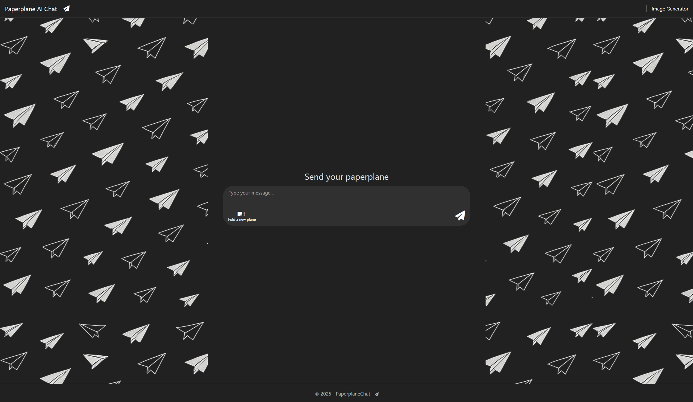
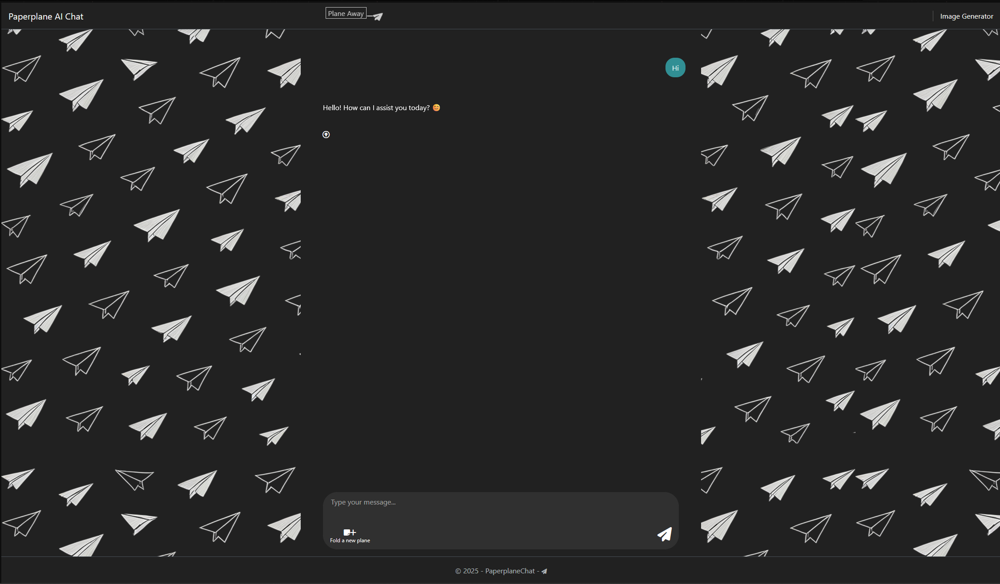
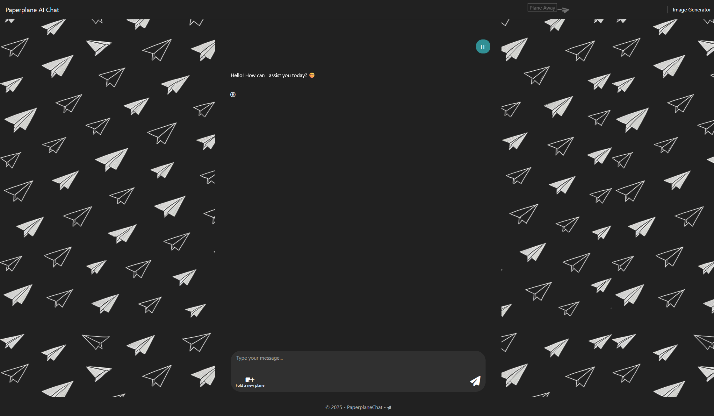
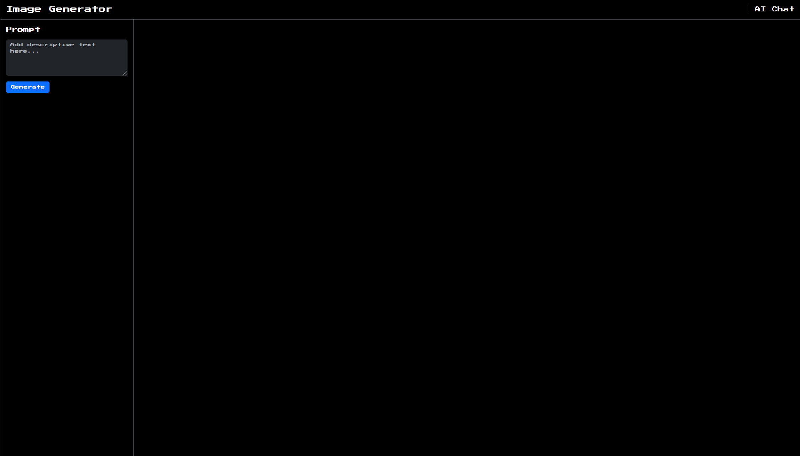

# Paperplane Chat

## Description
Paperplane Chat is an ASP.NET Core web application that integrates with **Azure OpenAI** for both chat and image generation.  
Users interact with an AI-powered chatbot and generate images from text prompts in the browser.

## Features
- 💬 AI Chat powered by **Azure OpenAI**
- 🖼️ Image generation using **Azure OpenAI Image API**
- 🎨 Responsive UI with Bootstrap
- 💻 JavaScript & jQuery frontend logic
- 🗂️ Session-stored chat history (conversation persists during browser session)
- ⚡ Smooth chat experience with "scroll-to-bottom" and "scroll-to-message" features
- 📩 Loading indicators and tooltips for better UX

## Technology Stack
- **Backend:** C#, .NET 9, ASP.NET Core MVC 
- **Frontend:** HTML, CSS, Bootstrap, JavaScript, jQuery
- **AI:** Azure OpenAI (GPT-4o, DALL-E 3)

## Installation
1. Clone the repository:
```bash
git clone https://github.com/Kvidi/PaperplaneChat.git 
``` 
2. Open the solution in Visual Studio 2022 (`PaperplaneChat.sln`).
3. Restore NuGet packages.
4. Copy the placeholder `appsettings.Template.json` to `appsettings.Development.json`  
    (`appsettings.Development.json` is ignored by Git for security reasons).  

    Then provide your own values for:   
    - **Azure OpenAI:**
        - `Endpoint`
        - `ApiKey`   
		
5. Make sure you have deployed models named `gpt-4o` (chat) and `dall-e-3` (image) in your Azure OpenAI resource.
6. Build and run the application.

## Usage
- Start a chat with the AI on the main page.
- Generate images by entering a prompt on the image generator page.

## Screenshots
### Chat start
*The chat interface in its initial state, ready for the first message.*


### First message – plane animation (mid-flight)
*The paper plane animation in mid-flight after sending the first message.*


### First message – plane animation (fading out)
*The paper plane animation nearing the end of its flight, starting to fade out.*


### Image generator
*The image generator page, where you can create images from text prompts.*


## Author
- Kvidi
